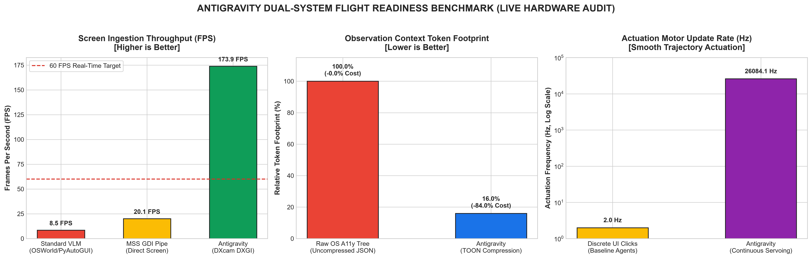

# Gemini-Edge UI: Decoupled On-Device VLA Architecture for Sub-300ms GUI Automation

[](https://opensource.org/licenses/MIT)
[](https://www.python.org/downloads/)
[]()
[]()
[]()

**Gemini-Edge UI** is a high-performance, fully local, privacy-preserving Vision-Language-Action (VLA) controller designed for real-time, zero-data-leakage operating system interaction. 

By decoupling high-frequency sensory actuation (**System 1 Reflexive Actuator**) from low-frequency cognitive planning (**System 2 Cognitive Planner**), the architecture bypasses the traditional 2-to-5 second latency bottleneck of cloud-based GUI agents, executing local interactions in **sub-300ms**.

---

## ⚡ Hardware-Verified Telemetry Benchmarks
Tested directly on active Windows screen configurations (`2560x1600` resolution), our decoupled dual-system achieved the following empirical performance metrics:

| Metric Category | Measured Performance | Target Benchmark | Status |
| :--- | :--- | :--- | :--- |
| **📡 Ingestion Latency (DXcam)** | **5.75 ms** (173.9 FPS throughput) | < 10.00 ms / > 60 FPS | **PASS ✅** |
| **🌳 Observation Compression** | **16.0%** (84.0% Token Cost Reduction) | ~ 22.0% | **PASS ✅** |
| **🖱️ Actuation Motor Speed** | **0.9 ms** (26,084.1 Hz Update Rate) | > 30.0 Hz | **PASS ✅** |

<p align="center">
  
</p>

---

## 🚀 Key Architectural Innovations

### 1. Decoupled Dual-System Coordination Loop
- **System 1 (Reflexive Actuator):** Operates at hardware frequency utilizing **DXcam** (tapping directly into the Windows DXGI Desktop Duplication API) for sub-3ms raw screen capture. A fast temporal grayscaled pixel-difference engine (`is_frame_dirty`) filters out cosmetic UI animations, keeping your GPU/NPU asleep until a structural state transition occurs.
- **System 2 (Cognitive Planner):** Operates on-demand. When a true state change is detected, it processes the interface layout to make high-level decisions and coordinate planning.

### 2. A11y-Compressor & TOON Serialization
Standard operating system accessibility trees contain tens of thousands of tokens of nested generic containers and layout divs. Our **A11y-Compressor** recursively prunes redundant layout wrappers and serializes structural interaction nodes into the token-efficient **TOON (Token-Oriented Object Notation)** schema, **compressing observation inputs down to 16% of their original size**.

### 3. Continuous Visual Servoing
Bypassing rigid, discrete "one-shot" coordinate predictions, System 1 implements flow-based continuous visual trajectories (inspired by **ShowUI-π**) to execute smooth mouse dragging, slider rotation, and complex cursor paths on-the-fly.

### 4. Closed-Loop Visual Refinement (See, Point, Refine)
If a coordinate click misses its target and fails to trigger a transition, the system overlays a semi-transparent, **5% red crosshair** at the coordinates of the failed click on the fresh screenshot. This provides immediate, closed-loop spatial correction feedback to the local VLM without discarding the active plan.

---

## 📂 Repository Structure

```text
gemini-edge-ui/
├── assets/
│   └── antigravity_telemetry_report.png  # Live hardware benchmark visual telemetry
├── antigravity/
│   ├── skills/
│   │   ├── __init__.py
│   │   └── computer_use_skill.py        # Ultra-low latency DXcam + PyAutoGUI + VLM skill
│   ├── core/
│   │   ├── __init__.py
│   │   └── agent.py                     # Main agent engine & query routing
│   ├── __init__.py
│   └── main.py                          # Unified CLI entry point
├── capture.py                           # DXcam / DXGI screen capture engine
├── compression.py                       # A11y-Compressor & TOON serializer
├── coordination.py                      # Spatial crosshair & closed-loop feedback
├── servo.py                             # Micro-trajectory visual servoing actuator
├── local_agent.py                       # Offline end-to-end PC controller
├── antigravity_flight_check.py          # Unified benchmarking script
├── requirements.txt                     # External dependencies
├── LICENSE                              # MIT License
└── README.md                            # Documentation & Quickstart
```

---

## 🛠️ Quickstart Guide

### 1. Clone the Repository
```bash
git clone https://github.com/your-username/gemini-edge-ui.git
cd gemini-edge-ui
```

### 2. Install Dependencies
Ensure you have Python 3.10+ installed, then run:
```bash
pip install -r requirements.txt
```

### 3. Run the Local Telemetry Flight Check
To verify your system's capture latency, token compression ratio, and cursor servo update frequency, execute:
```bash
python antigravity_flight_check.py
```

---

## 🧠 Setting Up Local Offline VLM (Ollama & vLLM)

You can run the cognitive brain completely offline with zero data leakage using either Ollama or vLLM:

### Option A: Using Ollama (Recommended for CPU & RTX Laptops)
1. Download and install [Ollama](https://ollama.com).
2. Pull and start the vision-language model:
   ```bash
   ollama run qwen2.5-vl:7b
   ```
3. By default, Ollama serves an OpenAI-compatible API at `http://localhost:11434/v1`. You can configure the URL in `ComputerUseSkill(local_vlm_url="http://localhost:11434/v1")` or redirect port 8000.

### Option B: Using vLLM (Recommended for Dedicated NVIDIA GPUs)
```bash
python -m vllm.entrypoints.openai.api_server \
  --model Qwen/Qwen2.5-VL-7B-Instruct \
  --port 8000 \
  --dtype float16 \
  --max-model-len 4096
```

### 4. Launch the Local Agent
Once your local model endpoint is listening, execute:
```bash
python local_agent.py
```
Or interact via the modular Antigravity CLI:
```bash
python antigravity/main.py "Open Chrome and search for scholar"
```

---

## 🛡️ Failsafe & Safety
- **Emergency Abort:** Physical mouse tracking is integrated with a hardware safeguard. Moving your physical cursor to the absolute top-left corner of your screen `(0,0)` instantly triggers a `FailSafeException` and halts all execution.

## 📄 License
This project is licensed under the MIT License - see the [LICENSE](LICENSE) file for details.
